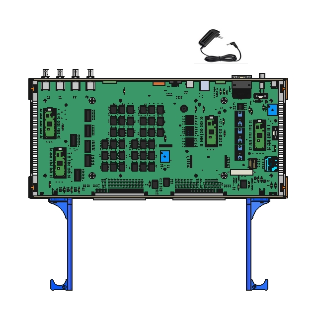

# FIRST STATION TEST InterconnectIO_BOX 500-1000-010

## Project Overview
This project involves the assembly of a custom **InterconnectIO_BOX** designed to be part of the **First TestStation** project ([FTS](https://FirstTestStation.github.io/FTS_Website/)). The primary goal of the InterconnectIO_BOX is to provide an interface between instruments and the Unit Under Test (U.U.T).

### Design Tools
- [Freecad 0.20.2 ](https://www.freecad.org/) - Free software application used to design rail guides and assemble the box.
- [Inkscape 1.1.2 ](https://inkscape.org/) - Free software application used to design front and back panel.
- [LibreOffice](https://www.libreoffice.org/download/download-libreoffice/) - Free Software application used to create assembly instructions and the Bill of Materials (BOM).
- [PicPick](https://picpick.app/en/) - Free application to capture and document image.

### Features

- **Stand-alone Operation**: The box is capable of functioning independently, without requiring external instruments or additional equipment.
- **Rackmount Capability**: Designed to be easily mounted in a standard rack chassis, providing flexibility for different setups.
- **Cost-Effective**: Built using affordable, readily available components, ensuring low production costs.

## Assembly Instructions
   Follow the document [Assembly_Instructions](pdf/InterconnectIO_Box_Assembly_Instruction_520-1000.pdf) to complete the assembly of the board.

## Design Files
- [Left Card Guide stl File](Drawing/Left_guide_drawing_515-1000.stl) – STL file for the left rail, to be used with a 3D printer.
- [Right Card Guide stl File](Drawing/Right_guide_drawing_515-1010.stl) – STL file for the right rail, to be used with a 3D printer.
- [Front panel drawing](Drawing/Panel_Front_drawing_512-1000.svg) – SVG file for the front panel, to be used with a laser cutter.
- [Back panel drawing](Drawing/Panel_Back_drawing_512-1010.svg) – SVG file for the back panel, to be used with a laser cutter.
- [Bill of Materials(BOM)](pdf/BOM_InterconnectIO_Box_510-1000.pdf) – List of components required to complete the assembly.
- [Freecad Folder](Freecad/) – Freecad Original design files.

## Verification
The **InterconnectIO Box** is equipped with multiple built-in features designed to facilitate the comprehensive verification of hardware functionality. It supports **SCPI commands**, allowing for internal testing and diagnostics. The hardware has been engineered specifically to aid in the validation of board functionality, ensuring thorough and efficient testing.

For detailed testing procedures, please refer to the [Test_Instructions](pdf/InterconnectIO_Box_Test_Instruction_520-1010.pdf) document to complete the verification of the InterconnectIO Box.

> **Note:** Verification can also be performed using the OpenTAP TestPlan software available in the GitHub repository:  
> [OpenTAP Selftest Sequence](https://github.com/FirstTestStation/FTS_OpenTAP_Selftest_Sequence)

## License

This project is licensed under the terms of the [CERN Open Hardware License Version 2 - Weakly Reciprocal (CERN-OHL-W 2.0)](https://ohwr.org/cern_ohl_w_v2.txt).

See the [LICENSE](./LICENSE) file in this repository for more details.

---

